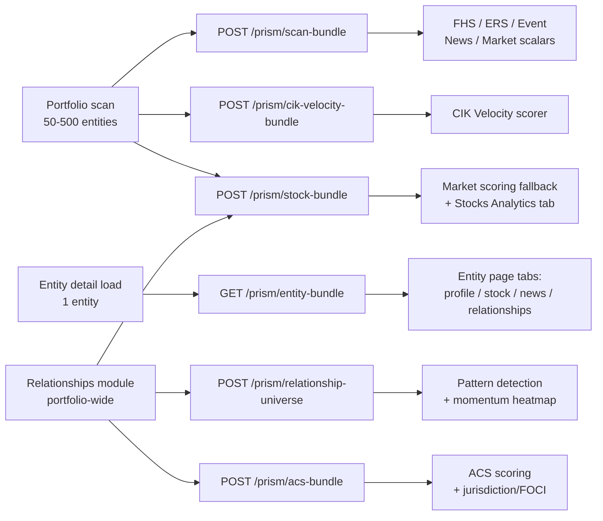

# Elemental Batch API Request Spec

> **Audience:** Lovelace / Elemental platform team.
> **Status:** Draft for review.
> **Companion doc:** [`design/elemental-interaction.md`](./elemental-interaction.md) — describes how Prism reads Elemental _today_. This doc describes how Prism _needs_ to read Elemental tomorrow.

## §1. Why now

Prism is a portfolio risk monitoring app that runs 50–500 entities through a multi-source scoring pipeline (FHS solvency, ERS governance, News pressure, Market signal, Event pressure, CIK velocity, ACS adversarial capital, Polymarket outlook) and must answer "is this company deteriorating, why, what is it connected to, what is changing now?" in under two minutes for the whole portfolio.

The current architecture (Galaxy quads + cross-entity property batch, documented in [`elemental-interaction.md`](./elemental-interaction.md) §7) is already a 10× improvement over the pre-refactor call graph, but it still hits the QS hard:

- **Portfolio scan, 50 entities:** ~103 Elemental calls = 3 cross-entity property batches + 50 per-entity Galaxy quads + ~50 citation MCP calls. Galaxy quads for a large entity (Apple) is 1–3 MB and ~67k quads, most of which Prism throws away.
- **Relationship Explorer, 50 entities:** **5 × N + ≤80 × N** = ~250 `elemental/find` calls + up to ~4,000 `entities/{neid}/name` calls. This is what took the server down in last week's engineering meeting.
- **Entity detail page:** a 4-step sequential pipeline (related-instruments → close_price probe → OHLCV → org fundamentals) in [`stockProfile.ts`](../server/utils/scoring/stockProfile.ts) that takes ~3–6s wall-clock per page.

The fundamental issue: Prism is recomposing high-level analytical shapes (a "scan bundle," an "entity profile," a "portfolio relationship graph") out of dozens of low-level primitives (per-entity quads, per-property finds, per-NEID name lookups). The recomposition happens **in TypeScript over the wire**, paying the round-trip tax once per primitive.

**What we need:** a small number of **wide, semantically-shaped, time-windowed batch endpoints** that match Prism's three real call sites — portfolio scan, entity detail load, relationships module — and let us replace 100–4,000 calls with a handful (typically 3 in parallel for a scan, 1 for an entity page, 1–2 for the relationships module).

Prism keeps scoring. Lovelace keeps storage, schema, and (now) the semantic-shape contracts.

---

## §2. The three trigger points

Every batch endpoint in this spec hangs off exactly one of these three user actions.



The scan fires three endpoints in parallel (`scan-bundle`, `cik-velocity-bundle`, `stock-bundle`) because they hit different data subsystems with very different cache TTLs (15min for market, 1hr for velocity aggregates, 4hr for governance/solvency). Bundling them into one call would force the slowest TTL on everything.

| Trigger             | Cardinality | Today's call count         | Target call count |
| ------------------- | ----------- | -------------------------- | ----------------- |
| Portfolio scan      | 50–500 ents | ~103 (50 ents)             | **3** (parallel)  |
| Entity detail load  | 1 ent       | 4–7 sequential per tab     | **1**             |
| Relationships build | 50–500 ents | 5N + ≤80N (~4,250 at 50)   | **1–2**           |
| ACS traversal       | 50–500 ents | ≤3 hops × N MCP per entity | **1**             |

---

## §3. Global time-window vocabulary

The rest of the spec references these constants by name. Every endpoint takes window overrides; defaults are these values.

| Constant                    | Window                             | Why                                                                                                                                                                                                                                                                                                                                                                                                                                                                                  | Source-of-truth in code                                                                                                                                      |
| --------------------------- | ---------------------------------- | ------------------------------------------------------------------------------------------------------------------------------------------------------------------------------------------------------------------------------------------------------------------------------------------------------------------------------------------------------------------------------------------------------------------------------------------------------------------------------------ | ------------------------------------------------------------------------------------------------------------------------------------------------------------ |
| `WINDOW_NEWS`               | trailing **90 days**               | News pressure averages sentiment over 30d; 24h summary needs a 30d baseline; we keep an extra 60d of buffer so cache misses don't lose recent context.                                                                                                                                                                                                                                                                                                                               | [`newsPressure.ts`](../server/utils/scoring/newsPressure.ts), [`newsSummary24h.ts`](../server/utils/scoring/newsSummary24h.ts)                               |
| `WINDOW_STOCKS`             | trailing **90 days**               | Window for `stock-bundle.ohlcv_90d` (daily OHLCV). Today's [`marketSignal.ts`](../server/utils/scoring/marketSignal.ts) fallback pulls 45d from the `stocks` MCP — 90d gives headroom for rolling 30d return/vol recomputation client-side and aligns with `WINDOW_NEWS`. Note: the `return_30d` / `volatility_30d` / `rsi_14` _scalar_ properties are pre-computed by Elemental — reading them needs no window. The 500-bar entity-page chart (§4.8C) is a separate, longer series. | [`marketSignal.ts`](../server/utils/scoring/marketSignal.ts), [`stockProfile.ts`](../server/utils/scoring/stockProfile.ts)                                   |
| `WINDOW_EDGAR`              | trailing **18 months**             | FHS Tier 1 needs the latest 2 reporting periods (≤6 months apart) for the leverage delta; Tier 3 looks at 365d of form types for late/amendment filings.                                                                                                                                                                                                                                                                                                                             | [`fhs/tier1Financials.ts`](../server/utils/scoring/fhs/tier1Financials.ts), [`fhs/tier3Behavioral.ts`](../server/utils/scoring/fhs/tier3Behavioral.ts)       |
| `WINDOW_CIK_VELOCITY`       | trailing **4 years (16 quarters)** | CIK velocity bucket-counts events by quarter. QoQ uses the latest two quarters; the trailing average uses every quarter in the window, so a longer window gives a more stable baseline for the divergence score.                                                                                                                                                                                                                                                                     | [`cikVelocity.ts`](../server/utils/scoring/cikVelocity.ts)                                                                                                   |
| `WINDOW_POLYMARKET`         | trailing **90 days**               | Markets that resolved more than 90d ago are no longer relevant to outlook; active markets always pull in.                                                                                                                                                                                                                                                                                                                                                                            | [`polymarketOutlook.ts`](../server/utils/scoring/polymarketOutlook.ts)                                                                                       |
| `WINDOW_DISTRESS_EVENTS`    | trailing **730 days**              | FHS Tier 2 `recencyMultiplier(date, 730)` decays linearly to 0.25 at 2 years.                                                                                                                                                                                                                                                                                                                                                                                                        | [`fhs/tier2Events.ts`](../server/utils/scoring/fhs/tier2Events.ts)                                                                                           |
| `WINDOW_OFFICER_DEPARTURES` | **90d** and **365d**               | Tier 3 / ERS Signal 3 use 90d (recent shocks); ERS Signal 6 cumulative-departure pattern uses 365d.                                                                                                                                                                                                                                                                                                                                                                                  | [`fhs/tier3Behavioral.ts`](../server/utils/scoring/fhs/tier3Behavioral.ts), [`ers/governanceSnapshot.ts`](../server/utils/scoring/ers/governanceSnapshot.ts) |
| `WINDOW_STAKE_CHANGES`      | trailing **365 days**              | FHS Tier 4 counts 13D/13G filings and amendments in the last year.                                                                                                                                                                                                                                                                                                                                                                                                                   | [`fhs/tier2Events.ts`](../server/utils/scoring/fhs/tier2Events.ts) (tier4 reuses the event stream)                                                           |

---

## §4. Per-module data contracts

For every scoring lens: the **exact property names we read** (including all aliases — Prism does `pid.X ?? pid.Y ?? pid.Z` because the schema isn't uniform), the **time window**, and **what we compute from it**. Lifted directly from the `PROP_ALIASES` maps in the scorer modules — these are not aspirational, they are what the scoring code reads today.

### 4.1 FHS Tier 1 — Hard Financials

**Source:** [`server/utils/scoring/fhs/tier1Financials.ts`](../server/utils/scoring/fhs/tier1Financials.ts) (`PROP_ALIASES`, lines 53–78).
**Window:** latest 2 reporting periods per fact (≤ 18 months back).
**Shape per fact:** `{ value: number, date: ISO8601, ref: string }`.

| Logical key          | Property name aliases (first match wins)                                                        |
| -------------------- | ----------------------------------------------------------------------------------------------- |
| `assets`             | `total_assets`, `assets`, `us_gaap:assets`                                                      |
| `liabilities`        | `total_liabilities`, `liabilities`, `us_gaap:liabilities`                                       |
| `equity`             | `stockholders_equity`, `shareholders_equity`, `partners_capital`, `us_gaap:stockholders_equity` |
| `revenue`            | `total_revenue`, `revenue`, `us_gaap:revenues`                                                  |
| `netIncome`          | `net_income`, `us_gaap:net_income_loss`                                                         |
| `currentAssets`      | `current_assets`, `us_gaap:assets_current`                                                      |
| `currentLiabilities` | `current_liabilities`, `us_gaap:liabilities_current`                                            |
| `cash`               | `cash_and_cash_equivalents`, `cash`, `us_gaap:cash_and_cash_equivalents_at_carrying_value`      |
| `operatingIncome`    | `operating_income`, `us_gaap:operating_income_loss`                                             |
| `interestExpense`    | `interest_expense`, `us_gaap:interest_expense`                                                  |
| `operatingCashFlow`  | `operating_cash_flow`, `us_gaap:net_cash_provided_by_used_in_operating_activities`              |
| `filingDate`         | `filing_date`, `report_date` — used for "freshest filing age" metric                            |

**Ratios computed in TS:**

```text
leverage_ratio       = liabilities / equity                  thresholds: >5 crit, >3 high, >2 med
equity_ratio         = equity / assets                       thresholds: <0 crit, <0.1 high, <0.2 med
net_margin           = net_income / revenue                  thresholds: <-0.5 crit, <-0.1 high, <0 med
current_ratio        = current_assets / current_liabilities
cash_ratio           = cash / current_liabilities
interest_coverage    = operating_income / interest_expense
ocf_to_liabilities   = operating_cash_flow / liabilities
leverage_delta       = leverage[t] - leverage[t-1]           ← why we need the prior period
```

### 4.2 FHS Tier 2 — Distress Events

**Source:** [`server/utils/scoring/fhs/tier2Events.ts`](../server/utils/scoring/fhs/tier2Events.ts) (`DISTRESS_EVENT_MAP`, lines 9–58).
**Window:** `WINDOW_DISTRESS_EVENTS` = trailing **730 days**.
**Shape per event:** `{ event_type: string, event_date: ISO8601, description: string, ref: string }`.

Substring-match on `event_type` against these 6 types (mapped to signals):

| `event_type` substring        | Signal               | Severity | Base score | Weight |
| ----------------------------- | -------------------- | -------- | ---------- | ------ |
| `FINANCING_BANKRUPTCY`        | `BANKRUPTCY_EVENT`   | critical | 100        | 3.0    |
| `DELISTING_NOTICE`            | `DELISTING_EVENT`    | critical | 90         | 2.5    |
| `ACCOUNTING_NON_RELIANCE`     | `NON_RELIANCE_EVENT` | critical | 85         | 2.0    |
| `FINANCING_TRIGGERING_EVENTS` | `TRIGGERING_EVENT`   | high     | 70         | 1.5    |
| `FINANCIAL_IMPAIRMENT`        | `IMPAIRMENT_EVENT`   | high     | 60         | 1.0    |
| `FINANCING_TERMINATION`       | `TERMINATION_EVENT`  | medium   | 50         | 1.0    |

Recency-decayed in TS by `recencyMultiplier = 1 - (days/730)*0.75`, floored at 0.25.

### 4.3 FHS Tier 3 — Behavioral Signals

**Source:** [`server/utils/scoring/fhs/tier3Behavioral.ts`](../server/utils/scoring/fhs/tier3Behavioral.ts).
Four independent slices, each with its own window:

1. **Latest filing date.** `filing_date` | `report_date`, just the timestamp. Drives "filing gap days" metric. Thresholds: ≥365d critical, ≥180d high, ≥90d medium.
2. **Form-type stream, trailing 365 days.** Each row is `{ value: form_type_string, date: filing_date, ref: string }`.
    - Late filings: substring `NT 10-K` or `NT 10-Q`. Thresholds: ≥3 crit, ≥2 high, ≥1 med.
    - Amendments: form ending in `/A`. Threshold: ≥5 emits `amendment_frequency` signal.
3. **Officer/director relationships with `end_date` in last 90 days.** Same shape as §4.6 below — Tier 3 just filters to recent departures.
4. **Events with category `Auditor Change` or substring `AUDITOR` in `event_type`, trailing 365 days.** Drives auditor-change count. Thresholds: ≥2 critical (`auditor_changes`), 1 high.

### 4.4 FHS Tier 4 — Stake Changes

**Source:** event stream filtered to forms `13D`, `13G`, `13D/A`, `13G/A` (consumed in the same scoring pass as Tier 2).
**Window:** `WINDOW_STAKE_CHANGES` = **365 days**.
**Shape per row:** `{ form: '13D'|'13G'|'13D/A'|'13G/A', filing_date: ISO8601, filer_name?: string, ref: string }`.

Computes: count of activist filings, count of amendments, recent stake exits.

### 4.5 FHS Tier 5 — Instruments

**Source:** [`server/utils/scoring/fhs/tier5Instruments.ts`](../server/utils/scoring/fhs/tier5Instruments.ts) (lines 44–86).
**Window:** latest value per fact.
**Shape:** `{ value: number, date: ISO8601, ref: string }`.

| Logical key  | Property name aliases                                                                      |
| ------------ | ------------------------------------------------------------------------------------------ |
| `debtDue18m` | `debt_due_18m`, `current_portion_long_term_debt`, `us_gaap:long_term_debt_current`         |
| `cash`       | `cash_and_cash_equivalents`, `cash`, `us_gaap:cash_and_cash_equivalents_at_carrying_value` |
| `longDebt`   | `long_term_debt`, `us_gaap:long_term_debt_noncurrent`                                      |

**Ratios:**

```text
maturity_coverage     = cash / debt_due_18m       <0.5 crit, <0.8 high, <1.2 med
near_term_debt_share  = debt_due_18m / long_debt  >0.6 high, >0.4 med
```

### 4.6 ERS — Governance

**Source:** [`server/utils/scoring/ers/governanceSnapshot.ts`](../server/utils/scoring/ers/governanceSnapshot.ts).

**A. Officer/director relationships, current set.** Incoming relationships to the entity NEID:

- Relationship types: `is_officer`, `is_director`, `officer_of`, `director_of`, `board_member_of`.
- Properties needed: `title`, `start_date`, `end_date`, `ref`.
- "Current" filter: `end_date IS NULL OR end_date > NOW()` — please apply server-side so we don't have to fetch the full historical roster.
- C-suite detection: case-insensitive substring match on `title` against `[CEO, CFO, CTO, COO, CMO, CHIEF, PRESIDENT, PRINCIPAL EXECUTIVE, PRINCIPAL FINANCIAL]`.

**B. Departures, two windows.** Same relationship shape with `end_date IN [today-90d, today]` (Signal 3) and `end_date IN [today-365d, today]` (Signal 6).

**C. Governance events, trailing 12 months.**

- Categories: `Auditor Change`, `Officer Change`, `Director Change`.
- Event types: `EXEC_DEPARTURE_APPOINTMENT`, `ACCOUNTING_AUDITOR_CHANGE`.
- Properties needed: `event_date`, `description`, `snippet` (8-K Item 5.02 free text), `ref`.

### 4.7 News Pressure + 24h Summary

**Source:** [`server/utils/scoring/newsPressure.ts`](../server/utils/scoring/newsPressure.ts), [`server/utils/scoring/newsSummary24h.ts`](../server/utils/scoring/newsSummary24h.ts).

**A. Aggregate numerical properties on the org NEID, latest value:**

| Logical key       | Property aliases                                    |
| ----------------- | --------------------------------------------------- |
| `sentiment`       | `sentiment`, `news_sentiment`, `article_sentiment`  |
| `mentionVelocity` | `mention_velocity`, `mentions_30d`, `article_count` |
| `articleCount`    | `article_count`, `news_count`                       |

**B. Article relationships, `WINDOW_NEWS` = trailing 90 days, `direction: both`:**

- Relationship types: `appears_in`, `mentioned_in`, `related_article`.
- Properties: `headline`, `published_date`, `sentiment`, `source`, `url`, `ref`.
- Cap: ~120 rows per entity (today's MCP call limit).

The 24h summary, mention-ratio classification, and sentiment trend are all derived in TS from this single 90d article payload — we do **not** need a separate 24h endpoint.

### 4.8 Market Signal + Stock Profile

**Source:** [`server/utils/scoring/marketSignal.ts`](../server/utils/scoring/marketSignal.ts), [`server/utils/scoring/stockProfile.ts`](../server/utils/scoring/stockProfile.ts).

Three distinct use cases, three different homes:

**A. Scan-time scalars (cheap, feeds `scan-bundle`):** latest scalar value of each of these on the org NEID — same property store as fundamentals, so co-fetching with `scan-bundle` is genuinely free:

| Logical key     | Property aliases                                      |
| --------------- | ----------------------------------------------------- |
| `return30d`     | `return_30d`, `price_change_30d`, `returns_30d`       |
| `volatility30d` | `volatility_30d`, `realized_volatility`, `volatility` |
| `rsi14`         | `rsi_14`, `rsi`                                       |
| `marketAnomaly` | `market_anomaly`, `anomaly_flag`                      |

No history. Just 4 scalars. Goes in `scan-bundle.market`.

**B. Portfolio-wide daily OHLCV (feeds `stock-bundle` §6.3):** trailing 90d OHLCV per portfolio NEID, for the market-scoring fallback when the scalars in (A) are missing AND for the Stocks Analytics tab in the Relationships page. Replaces today's `portfolioStockAnalytics.ts` iteration of `getStockEntityProfile()` × N. Per-NEID payload:

- Disambiguated `financial_instrument` (see §5.3) — the graph often has both `NASDAQ:CCL` and `CCL` and only one carries price data.
- Daily OHLCV (`close_price`, `open_price`, `high_price`, `low_price`, `trading_volume`) trailing **90 days**.
- Identity: `ticker_symbol`, `exchange`, `currency`, `sector`, `industry`.

**C. Entity-page detail (feeds `entity-bundle` §6.4):** everything from (B) for one NEID, **plus** up to 500 historical daily bars for the chart panel, **plus** the 14-line-item org fundamentals below (latest value each, with refs):

| Property aliases                                                                           |
| ------------------------------------------------------------------------------------------ |
| `total_revenue`, `us_gaap:revenues`, `ifrs:revenue`                                        |
| `net_income`, `us_gaap:net_income_loss`, `ifrs:profit_loss`                                |
| `total_assets`, `assets`, `us_gaap:assets`, `ifrs:assets`                                  |
| `total_liabilities`, `liabilities`, `us_gaap:liabilities`, `ifrs:liabilities`              |
| `shareholders_equity`, `us_gaap:stockholders_equity`, `ifrs:equity`                        |
| `shares_outstanding`, `dei:common_shares_outstanding`, `us_gaap:common_shares_outstanding` |
| `eps_basic`, `us_gaap:eps_basic_xbrl`                                                      |
| `eps_diluted`, `us_gaap:eps_diluted_xbrl`                                                  |
| `us_gaap:dividends_common`                                                                 |
| `us_gaap:gross_profit`                                                                     |
| `operating_cash_flow`, `us_gaap:operating_cash_flow`, `ifrs:operating_cash_flow`           |
| `long_term_debt`, `us_gaap:long_term_debt`, `total_debt`                                   |
| `dei:public_float`                                                                         |
| `dei:number_of_employees`                                                                  |

### 4.9 Event Pressure

**Source:** [`server/utils/scoring/eventPressure.ts`](../server/utils/scoring/eventPressure.ts).
**Window:** trailing ~24 months (reuses the same event stream as Tier 2 / CIK Velocity).
**Shape per event:** `{ event_type: string, event_date: ISO8601, description?: string, ref: string }`.

Substring weights (computed in TS):

| Substring    | Weight |
| ------------ | ------ |
| `BANKRUPTCY` | 28     |
| `DELIST`     | 24     |
| `DEFAULT`    | 22     |
| `AUDITOR`    | 18     |
| `RESTRUCTUR` | 16     |
| `OFFICER`    | 12     |
| `DIRECTOR`   | 10     |
| `IMPAIR`     | 12     |
| (default)    | 6      |

Recency multipliers: ≤14d=1.0, ≤30d=0.85, ≤90d=0.6, else 0.35. 14-day clustering bonus: ≥5 events +40, ≥3 events +25.

### 4.10 CIK Velocity

**Source:** [`server/utils/scoring/cikVelocity.ts`](../server/utils/scoring/cikVelocity.ts).
**Window:** `WINDOW_CIK_VELOCITY` = trailing **4 years (16 quarters)**.
**Feeds:** dedicated `cik-velocity-bundle` (§6.2), not `scan-bundle`. Split out because the 4-year window doesn't match `scan-bundle`'s 730-day event window, the output is tiny (~16 numbers per entity), and Lovelace can answer it from a materialized quarter-aggregate without scanning the full event detail.

**Wanted shape per entity (preferred — pre-bucketed):**

```json
{ "2022-Q3": 8, "2022-Q4": 11, "2023-Q1": 14, ... }
```

**Acceptable fallback:** raw `[{event_date: ISO8601}]` list, we bucket in TS via `quarterKey()`.

Computes: QoQ percent change (latest two quarters), trailing 16-quarter average, divergence score (`qoq - avgDiff`), divergence label (`gaining-attention | fading | in-sync`).

### 4.11 ACS — Adversarial Capital

**Source:** [`server/utils/scoring/acs/graphTraversal.ts`](../server/utils/scoring/acs/graphTraversal.ts), [`server/utils/scoring/acs/index.ts`](../server/utils/scoring/acs/index.ts).

**A. Per-entity ownership traversal, 3 hops, `direction: both`:**

- Relationship types: `beneficial_owner_of`, `subsidiary_of`.
- Properties needed per edge: `ownership_percentage`, `jurisdiction` | `country_of_incorporation`.
- Output shape (today computed by BFS in TS):

```ts
type TraversedNode = {
    neid: string;
    name: string;
    hopDistance: 1 | 2 | 3;
    relationshipType: string;
    ownershipPercentage: number | null;
    jurisdiction: string | null;
};
```

**B. Screening list, portfolio-wide, refreshed weekly:**

- Schema flavor whose name contains `screening`, `sanctions`, or `watchlist`.
- Output: list of NEIDs of every entity in that flavor.
- Today: `getSchema()` → `getFlavorEntities(flavor.name)`.

### 4.12 Polymarket

**Source:** [`server/utils/scoring/polymarketOutlook.ts`](../server/utils/scoring/polymarketOutlook.ts).
**Status:** No change requested. Polymarket data ships through the `polymarket` Elemental MCP server (sibling to `elemental` and `stocks` in the same MCP family); we already get the structured market list we need. Listed here only so the spec is complete: trailing **90 days** of active markets per entity name, with `question`, `active`, `category`, `probability`.

---

## §5. The N+1 fanouts we want killed

Three call patterns that account for the bulk of today's traffic and that the proposed endpoints in §6 are explicitly designed to eliminate.

### 5.1 `relationships.ts::buildRelationshipUniverse` — the server-killer

**File:** [`server/utils/scoring/relationships.ts`](../server/utils/scoring/relationships.ts) lines 75–143.

For each of N portfolio entities, runs **5 parallel `findEntities({type: 'linked', …})` calls** (companies, people, owners, instruments, locations) — that's already 5×N. Then for each EID returned, runs **`getEntityName(eid)`** — typically ≤80 lookups per portfolio entity. For a 50-entity portfolio: **~250 find + ≤4,000 name lookups**. This is the call pattern that took the server down.

Replace with: §6.5 `POST /prism/relationship-universe`.

### 5.2 Citation resolution loops

Every scorer collects `ref://…` strings from the quads/events/relationships it touched, then calls `elemental_get_citations` to resolve them to URL/title/snippet. Each scorer does this independently per entity, so a 50-entity scan generates ~50 citation MCP calls minimum, more if scorers don't share.

Replace with: citations bundled into `scan-bundle` and `entity-bundle` server-side (Lovelace already has them — they're inline in the property quads in Galaxy).

### 5.3 Stock-instrument disambiguation

[`stockProfile.ts`](../server/utils/scoring/stockProfile.ts) lines 386–431: probes `close_price` across up to 8 equity-candidate NEIDs because the graph often has both `NASDAQ:CCL` and `CCL` and only one carries price data. This is `getPropertyValues(8 NEIDs, [close_pid])` — one batch call, but it's load on the QS that the server already knows the answer to.

Replace with: server-side disambiguation in both `stock-bundle` (§6.3, portfolio-wide) and `entity-bundle` (§6.4, single entity) returns the single canonical `financial_instrument` NEID per org.

---

## §6. Proposed batch endpoints

URL paths use a `/prism/*` namespace under the existing tenant-scoped gateway prefix (`/api/qs/{org}/prism/*`). All endpoints support an `If-None-Match` ETag header for client-side cache validation.

### 6.1 `POST /prism/scan-bundle` — the synchronous scan call

**Replaces:** fast-mode prefetch (3 calls) + per-entity Galaxy quads (N calls) + citation resolution (~N calls).
**Trigger:** [`server/api/agents/scan.post.ts`](../server/api/agents/scan.post.ts). Fires in parallel with `cik-velocity-bundle` (§6.2) and `stock-bundle` (§6.3).
**Target wall-clock:** ≤ 30s for 100 entities (today ≥ 60s on a warm cache, longer on cold).
**Scope:** everything every scoring lens needs **except** CIK velocity counts (own endpoint, §6.2) and daily OHLCV history (own endpoint, §6.3).

**Request:**

```ts
type ScanBundleRequest = {
    neids: string[]; // 1–500 portfolio NEIDs
    windows?: Partial<{
        // all default to the §3 constants
        edgar_months: number; // default 18
        distress_days: number; // default 730
        news_days: number; // default 90
        officer_departure_days: number; // default 365 (returns both 90d and 365d slices)
        stake_change_days: number; // default 365
    }>;
    include?: ('news' | 'governance' | 'events' | 'market' | 'fundamentals')[]; // default: all
};
```

**Response (one bundle per NEID):**

```ts
type ScanBundle = {
    bundles: Array<{
        neid: string;
        name: string;
        flavor: string;

        // §4.1 + §4.5 — last 2 reporting periods per fact, latest value if you can only return one
        fundamentals: Record<string, Array<{ value: number; date: string; ref: string }>>;

        // §4.3 — filing recency + form-type history
        filings: {
            latest: { date: string; form_type: string; ref: string } | null;
            window365: Array<{ date: string; form_type: string; ref: string }>;
        };

        // §4.2 + §4.3 + §4.4 + §4.9 — one event stream, multiple consumers (CIK velocity uses §6.2 instead)
        events: {
            window730: Array<{
                event_type: string;
                event_date: string;
                description: string | null;
                snippet: string | null;
                category: string | null;
                ref: string;
            }>;
        };

        // §4.6 — governance with server-side "current" filter applied
        governance: {
            officers: Array<{
                neid: string;
                name: string;
                title: string;
                start_date: string | null;
                end_date: string | null;
                ref: string;
            }>;
            directors: Array<{
                /* same shape */
            }>;
        };

        // §4.7 — articles in the 90d window, used by both newsPressure and newsSummary24h
        news: {
            sentiment_latest: number | null;
            mention_velocity_latest: number | null;
            article_count_latest: number | null;
            articles_90d: Array<{
                headline: string;
                published_date: string;
                sentiment: number | null;
                source: string | null;
                url: string | null;
                ref: string;
            }>;
        };

        // §4.8A — scan-time scalars, no history
        market: {
            return_30d: number | null;
            volatility_30d: number | null;
            rsi_14: number | null;
            market_anomaly: number | null;
        };

        // Deterministic per-lens coverage flags so the UI doesn't have to guess
        coverage: {
            sec: boolean;
            news: boolean;
            stock: boolean;
            governance: boolean;
            events: boolean;
        };

        // Citations inlined — no separate elemental_get_citations call needed
        citations: Record<
            string,
            { url: string; title: string; snippet?: string; source: string; date?: string }
        >;
    }>;

    // Diagnostics block — helps us tune cache TTLs and verify coverage
    diagnostics: {
        generated_at: string;
        cache_hits: number;
        cache_misses: number;
        elemental_round_trips_internal: number;
    };
};
```

### 6.2 `POST /prism/cik-velocity-bundle` — quarterly event aggregates

**Replaces:** the `elemental_get_events` MCP call inside [`cikVelocity.ts`](../server/utils/scoring/cikVelocity.ts) (currently runs per-entity with `limit: 500` and buckets in TS).
**Trigger:** portfolio scan, fired in parallel with §6.1 and §6.3.
**Why separate:** different cache TTL (1hr vs 15min for `scan-bundle`), different window (4 years vs 730d), tiny output (~16 numbers per entity), and Lovelace can answer it from a materialized quarter-aggregate without scanning the full event detail.

**Request:**

```ts
type CikVelocityBundleRequest = {
    neids: string[]; // 1–500 portfolio NEIDs
    quarters?: number; // default 16 (4 years)
};
```

**Response — pre-bucketed quarter counts per NEID:**

```ts
type CikVelocityBundle = {
    bundles: Array<{
        neid: string;
        // YYYY-QN -> event count; missing keys = zero
        quarter_counts: Record<string, number>;
        // Latest two quarters explicitly, so we don't have to find them by sorting keys
        latest_quarter: string | null;
        prev_quarter: string | null;
    }>;
};
```

**Acceptable fallback if pre-bucketing is infeasible:** raw `event_dates: string[]` per NEID and we bucket in TS via `quarterKey()`. Either shape lets Prism compute QoQ percent change, the 16-quarter trailing average, the divergence score, and the divergence label.

### 6.3 `POST /prism/stock-bundle` — portfolio-wide daily OHLCV

**Replaces:** the per-entity iteration of `getStockEntityProfile()` in [`portfolioStockAnalytics.ts`](../server/utils/scoring/portfolioStockAnalytics.ts), AND the OHLCV fallback path in [`marketSignal.ts`](../server/utils/scoring/marketSignal.ts) (currently 45-day `stocks` MCP call per entity).
**Trigger:** portfolio scan (fired in parallel with §6.1, §6.2), and the Stocks Analytics tab on the Relationships page.
**Why separate:** different data subsystem (market data, not the property store), different TTL (15min for prices vs 4hr for governance), and per-NEID payload is heavy (~65 daily bars × 5 OHLCV fields × 500 entities ≈ 160k values uncompressed). Bundling into `scan-bundle` would balloon its payload and force the long TTL on fast-moving prices.

**Request:**

```ts
type StockBundleRequest = {
    neids: string[]; // org NEIDs (Lovelace disambiguates to instrument server-side)
    window_days?: number; // default 90 (WINDOW_STOCKS)
};
```

**Response — one per org NEID, with the disambiguated instrument inlined:**

```ts
type StockBundle = {
    bundles: Array<{
        neid: string; // org NEID we asked about
        instrument: {
            neid: string; // canonical financial_instrument NEID
            name: string;
            ticker: string | null;
            exchange: string | null;
            currency: string | null;
            sector: string | null;
            industry: string | null;
        } | null; // null if no equity instrument linked
        ohlcv_90d: Array<{
            date: string; // YYYY-MM-DD
            open: number;
            high: number;
            low: number;
            close: number;
            volume: number;
        }>;
        coverage: 'full' | 'partial' | 'none'; // <5 bars = partial, 0 = none
    }>;
};
```

This bundle is what powers both market-scoring's OHLCV fallback (when the scalar properties in `scan-bundle.market` are missing) and the cross-portfolio Stocks Analytics view. The entity page reuses the same per-NEID shape inside `entity-bundle` (§6.4) but with extra fields (chart bars + fundamentals).

### 6.4 `GET /prism/entity-bundle/{neid}` — the entity page call

**Replaces:** the 4-step pipeline in [`stockProfile.ts`](../server/utils/scoring/stockProfile.ts) + the existing per-entity `/portfolios/{id}/entity/{neid}/*` endpoints' Elemental fan-out.
**Trigger:** [`pages/entity/[neid].vue`](../pages/entity/[neid].vue) on mount.

**Query params:**

```text
?ohlcv_bars=500           # cap on the chart series (90d ≈ 65 daily bars; 500 ≈ ~2y)
&include_chart=true       # set false during scoring fallbacks to skip OHLCV
```

**Response — `scan-bundle` slice + the entity-page-only extras:**

```ts
type EntityBundle = ScanBundle['bundles'][0] & {
    // §4.8C — same shape as one bundle from §6.3 stock-bundle, plus a long chart series
    market_detail: StockBundle['bundles'][0] & {
        // Up to `ohlcv_bars` daily closes for the chart panel (typically ~500 ≈ 2y)
        ohlcv_chart: Array<{ date: string; close: number; volume?: number }>;
    };

    // §4.8C — full 14-line-item org fundamentals (deeper than fundamentals in §6.1)
    fundamentals_full: Record<string, { value: number; date: string; ref: string } | null>;

    // §4.11A — per-entity ownership graph for the relationships tab
    ownership_traversal: Array<{
        neid: string;
        name: string;
        hop: 1 | 2 | 3;
        relationship_type: string;
        ownership_percentage: number | null;
        jurisdiction: string | null;
    }>;
};
```

### 6.5 `POST /prism/relationship-universe` — the relationships page call

**Replaces:** [`buildRelationshipUniverse`](../server/utils/scoring/relationships.ts) — the 5N + ≤80N fan-out from §5.1.
**Trigger:** [`pages/relationships.vue`](../pages/relationships.vue), [`server/api/portfolios/[id]/relationships/patterns.get.ts`](../server/api/portfolios/[id]/relationships/patterns.get.ts).

**Request:**

```ts
type RelationshipUniverseRequest = {
    neids: string[]; // portfolio entities
    hop_depth?: 1 | 2; // default 1
};
```

**Response — deduped, all four neighbor classes in one shot, names already resolved:**

```ts
type RelationshipUniverse = {
    nodes: {
        companies: Array<{ neid: string; name: string; connects_to: string[] }>; // connects_to = NEIDs of portfolio entities
        people: Array<{ neid: string; name: string; titles: string[]; connects_to: string[] }>;
        instruments: Array<{ neid: string; name: string; connects_to: string[] }>;
        locations: Array<{ neid: string; name: string; connects_to: string[] }>;
    };
    edges: Array<{
        source: string; // portfolio NEID
        target: string; // neighbor NEID
        relationship: string; // e.g. "subsidiary_of", "is_officer", "lender_of"
    }>;
};
```

Relationship types to traverse (lifted from `relationships.ts` lines 91–97):

| Neighbor class | Property aliases                                         | Direction |
| -------------- | -------------------------------------------------------- | --------- |
| companies      | `subsidiary_of`, `compensation_peer_of`                  | outgoing  |
| people         | `is_officer`, `is_director`, `officer_of`, `director_of` | incoming  |
| owners         | `is_beneficial_owner`, `beneficial_owner_of`             | incoming  |
| instruments    | `issued_by`, `lender_of`, `holds_position`               | incoming  |
| locations      | `is_located_at`, `located_at`                            | outgoing  |

### 6.6 `POST /prism/acs-bundle` — the ACS call

**Replaces:** per-NEID BFS in [`acs/graphTraversal.ts`](../server/utils/scoring/acs/graphTraversal.ts) + the once-per-7d screening-list discovery.
**Trigger:** ACS scorer during scans + relationships page jurisdiction view.

**Request:**

```ts
type AcsBundleRequest = {
    neids: string[];
    max_depth?: 1 | 2 | 3; // default 3
};
```

**Response:**

```ts
type AcsBundle = {
    bundles: Array<{
        neid: string;
        traversal: Array<{
            neid: string;
            name: string;
            hop: 1 | 2 | 3;
            relationship_type: 'beneficial_owner_of' | 'subsidiary_of';
            ownership_percentage: number | null;
            jurisdiction: string | null;
        }>;
    }>;
    // The shared screening list — once per portfolio scan, not per entity
    screening_list_neids: string[];
    screening_list_source: string; // e.g. "sanctions_2026_05"
};
```

### 6.7 No-change endpoints (explicit "fine as-is")

Listed so Lovelace doesn't try to redesign these.

| Endpoint                                        | Why it stays                                                                                                  |
| ----------------------------------------------- | ------------------------------------------------------------------------------------------------------------- |
| `POST /entities/search`                         | Fuzzy name → NEID resolution. Used by portfolio create + name hydration.                                      |
| `GET /elemental/metadata/schema`                | PID/flavor discovery. Cached 5min process-wide.                                                               |
| `elemental_get_citations` MCP                   | Citation blobs (document text). Can stay MCP, or fold into bundles.                                           |
| `GET /galaxy/stats`                             | Capability probe. Cheap and cached 5min.                                                                      |
| `polymarket` and `stocks` Elemental MCP servers | Sibling MCP servers in the same family as `elemental`. Already shaped well for our use; no changes requested. |

---

## §7. Caching contracts

The bundle endpoints should return `ETag` and `Last-Modified` headers. Prism keeps the cache TTLs from [`server/utils/scoring/cache.ts`](../server/utils/scoring/cache.ts) for the scored outputs; this table describes what we'd like the **server** to cache for the raw bundles.

| Bundle                  | Cache key                                | TTL        | Rationale                                                                                               |
| ----------------------- | ---------------------------------------- | ---------- | ------------------------------------------------------------------------------------------------------- |
| `scan-bundle`           | `(org, sorted neids hash, windows hash)` | **15 min** | Matches Prism's `market` and `news` TTLs — the fastest-moving signals.                                  |
| `cik-velocity-bundle`   | `(org, sorted neids hash, quarters)`     | **1 hr**   | Quarter-bucket aggregates change once a filing lands; an hour is generous.                              |
| `stock-bundle`          | `(org, sorted neids hash, window_days)`  | **15 min** | Same as Prism's `market` TTL — daily bars update once a day but intraday scalars don't justify shorter. |
| `entity-bundle`         | `(org, neid)`                            | **15 min** | Same reasoning; entity pages re-fetch on tab switch.                                                    |
| `relationship-universe` | `(org, sorted neids hash, hop_depth)`    | **4 hr**   | Matches Prism's `solvency` / `executive` / `acs` TTLs — slow-moving graph.                              |
| `acs-bundle`            | `(org, sorted neids hash, max_depth)`    | **4 hr**   | Same.                                                                                                   |
| `screening_list_neids`  | `(org)`                                  | **7 days** | Matches Prism's existing `screening-list` TTL. Changes only when a new list lands.                      |

Prism will pass `If-None-Match` with the previous ETag and treat `304 Not Modified` as a hot cache hit.

---

## §8. Error & coverage shape

The current pipeline's `hasRealData` is a heuristic each scorer re-derives (`if (events.length > 0)`, `if (closes.length >= 5)`, etc.). This is fragile and produces inconsistent UI states.

We want every bundle to return a **per-lens coverage flag** the server determines authoritatively:

```ts
type Coverage = {
    sec: boolean; // any XBRL fact returned in fundamentals
    news: boolean; // any article in articles_90d OR any sentiment scalar
    stock: boolean; // any market scalar OR a non-null market_detail.instrument
    governance: boolean; // any officer/director relationship returned
    events: boolean; // any event in events.window730
};
```

Plus a per-bundle error envelope for partial failures (we want to score what we got, not abort the whole portfolio):

```ts
type BundleError = {
  lens: keyof Coverage;
  code: 'upstream_timeout' | 'no_data' | 'permission_denied' | 'malformed';
  detail?: string;
};

// On each bundle:
errors?: BundleError[];
```

Prism will set the row's coverage chips from `coverage` and surface `errors` in the per-entity diagnostics panel.

---

## §9. Open questions for Lovelace

These are the points I couldn't resolve from the Prism side; flagging them so Lovelace can shape the contract.

1. **Quarterly bucketing for CIK velocity (§4.10 → §6.2) — server-side or TS?**
   Strongly prefer server-side `quarter_counts` because it lets you cache a tiny aggregate (~16 numbers/entity) with a 1-hour TTL instead of returning the full 4-year event detail every scan. If pre-bucketing is infeasible, raw `event_dates: string[]` per NEID is fine and we bucket in TS.

2. **Article-relationship direction.**
   [`newsPressure.ts`](../server/utils/scoring/newsPressure.ts) and [`newsSummary24h.ts`](../server/utils/scoring/newsSummary24h.ts) both pass `direction: 'both'` today. Is that the right semantic for "articles that mention this entity"? If `incoming` is more correct we should align.

3. **"Current officer" filter.**
   We want the server to apply `end_date IS NULL OR end_date > NOW()` when we ask for the current roster, so we don't transfer the historical 5-year roster every scan. Is this practical against the underlying property store?

4. **Instrument disambiguation (§5.3).**
   For a given organization NEID, which `financial_instrument` is the active common equity? The graph often has both `NASDAQ:CCL` and `CCL` — Prism today probes `close_price` row counts across 8 candidates. Can you do this server-side, and if so, by what heuristic — most recent close, highest row count, a specific flavor sub-type?

5. **Citations inline vs. on-demand.**
   §6.1 inlines `citations: Record<ref, { url, title, snippet, ... }>` in every scan bundle. That probably bloats the payload — willing to keep `elemental_get_citations` on MCP if you'd rather not duplicate. Easier for us, costlier for you.

6. **Schema-discovery for screening flavors.**
   Today we walk `getSchema()` looking for flavor names containing `screening`/`sanctions`/`watchlist`. Brittle. Could you expose a deterministic `screening_list_flavors` field in the schema response, or a dedicated `/screening-lists` endpoint?

7. **Pagination on bundles.**
   What's the max entity count per `scan-bundle` request? Prism portfolios can hit 500. If you'd rather we page at 50 or 100, we'll batch on our side; just tell us the ceiling.

8. **Streaming.**
   `scan-bundle` for 500 entities is going to be a 10–30 MB JSON blob. Do you want us to call SSE-style (one bundle per event), or is gzipped HTTP fine? Prism's scan UI already speaks SSE so either works.

---

## §10. Quick reference — module → endpoint map

| Scoring lens                   | Code location                                                                      | Today's primitives                      | Proposed endpoint                                    |
| ------------------------------ | ---------------------------------------------------------------------------------- | --------------------------------------- | ---------------------------------------------------- |
| FHS Tier 1                     | [`fhs/tier1Financials.ts`](../server/utils/scoring/fhs/tier1Financials.ts)         | `getPropertyValues` × 11 PIDs           | `scan-bundle.fundamentals`                           |
| FHS Tier 2                     | [`fhs/tier2Events.ts`](../server/utils/scoring/fhs/tier2Events.ts)                 | `elemental_get_events` MCP              | `scan-bundle.events.window730`                       |
| FHS Tier 3                     | [`fhs/tier3Behavioral.ts`](../server/utils/scoring/fhs/tier3Behavioral.ts)         | `getPropertyValues` + 2 MCP calls       | `scan-bundle.filings` + `.governance` + `.events`    |
| FHS Tier 4                     | (folded into Tier 2 event stream)                                                  | filtered event stream                   | `scan-bundle.events.window730` (filter `13D/13G`)    |
| FHS Tier 5                     | [`fhs/tier5Instruments.ts`](../server/utils/scoring/fhs/tier5Instruments.ts)       | `getPropertyValues` × 3 PIDs            | `scan-bundle.fundamentals`                           |
| ERS                            | [`ers/governanceSnapshot.ts`](../server/utils/scoring/ers/governanceSnapshot.ts)   | `elemental_get_related` + `_get_events` | `scan-bundle.governance` + `.events`                 |
| News Pressure                  | [`newsPressure.ts`](../server/utils/scoring/newsPressure.ts)                       | `getPropertyValues` + MCP fallback      | `scan-bundle.news`                                   |
| News 24h Summary               | [`newsSummary24h.ts`](../server/utils/scoring/newsSummary24h.ts)                   | `elemental_get_related(article)`        | `scan-bundle.news.articles_90d` (derived in TS)      |
| Market Signal (scalars)        | [`marketSignal.ts`](../server/utils/scoring/marketSignal.ts)                       | `getPropertyValues` × 4 PIDs            | `scan-bundle.market`                                 |
| Market Signal (OHLCV fallback) | [`marketSignal.ts`](../server/utils/scoring/marketSignal.ts)                       | `stocks` MCP × N entities               | `stock-bundle`                                       |
| Portfolio Stock Analytics      | [`portfolioStockAnalytics.ts`](../server/utils/scoring/portfolioStockAnalytics.ts) | `getStockEntityProfile` × N             | `stock-bundle`                                       |
| Stock Profile (entity page)    | [`stockProfile.ts`](../server/utils/scoring/stockProfile.ts)                       | 4-step pipeline                         | `entity-bundle.market_detail` + `.fundamentals_full` |
| Event Pressure                 | [`eventPressure.ts`](../server/utils/scoring/eventPressure.ts)                     | `elemental_get_events` MCP              | `scan-bundle.events.window730`                       |
| CIK Velocity                   | [`cikVelocity.ts`](../server/utils/scoring/cikVelocity.ts)                         | `elemental_get_events` MCP × N          | `cik-velocity-bundle`                                |
| ACS                            | [`acs/graphTraversal.ts`](../server/utils/scoring/acs/graphTraversal.ts)           | per-NEID BFS via MCP                    | `acs-bundle`                                         |
| Relationship Universe          | [`relationships.ts`](../server/utils/scoring/relationships.ts)                     | 5N `find` + ≤80N `name`                 | `relationship-universe`                              |
| Polymarket                     | [`polymarketOutlook.ts`](../server/utils/scoring/polymarketOutlook.ts)             | `polymarket` Elemental MCP              | (no change — already well-shaped)                    |
