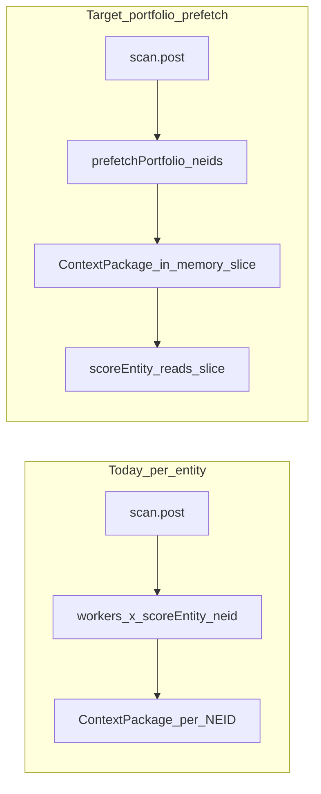

# Elemental REST API Integration

The shipped API (`elemental-rest-api.md`) is the HTTP realization of the
`elemental-batch-api-request.md` ask. Two surfaces on the Query Server (same
host/auth as `/galaxy/*`, gated on the galaxy capability): 10 thin lenses
(batch over NEIDs, bare NEIDs + names resolved separately) and 5 bundles
(`schema`, `cik-velocity-bundle`, `relationship-universe`, `acs-bundle`,
`stock-bundle`). Citations stay on MCP; ETag is deferred.

Decisions confirmed:

- Replace all fanout paths the doc covers.
- Keep the `isGalaxyEnabled` gate as a rollout switch.
- Delete each legacy path only after that lens is verified.

## Core Architectural Change

Today scoring is lazy/per-entity:

- `server/api/agents/scan.post.ts` runs `scoreEntity(neid)` in a worker loop.
- Each call builds one `ContextPackage` per NEID in
  `server/utils/scoring/contextPackage.ts`.

The thin lenses are already batch-over-portfolio, so the real performance win
requires eager portfolio-wide prefetch, then slicing results into per-entity
context.

## Phase 0 - Foundation

- Add POST-capable Prism REST helper(s) reusing gateway auth/logging semantics.
- Add `getPrismSchema()` cache (`GET /prism/schema`) and PID/FID resolvers.
- Add batch name resolver (`POST /entities/names`).
- Add typed Prism client module (one function per endpoint we consume).

## Phase 1 - Portfolio Prefetch + Context Slicing

- Add `prefetchPortfolio(event, neids)` that calls thin lenses once per scan.
- Refactor `getContextPackage` to read from prefetched per-entity slices.
- Wire prefetch into scan startup before per-entity scoring workers.

## Phase 2 - Heavy Composed Views to Bundles

- `relationship-universe`:
    - Replace fanout in `server/utils/scoring/relationships.ts`.
- `acs-bundle`:
    - Replace ownership traversal + screening-list flavor scan in
      `server/utils/scoring/acs/*`.
- `stock-bundle` / `ohlcv-series`:
    - Replace stock disambiguation + OHLCV fanout in
      `server/utils/scoring/stockProfile.ts`,
      `server/utils/scoring/marketSignal.ts`,
      `server/utils/scoring/portfolioStockAnalytics.ts`,
      `server/utils/scoring/holdingValuation.ts`.
- `cik-velocity-bundle`:
    - Replace event-stream bucketing in `server/utils/scoring/cikVelocity.ts`.

## Phase 3 - Verify, Then Delete Legacy

- Verify parity per migrated lens while gate is on.
- Remove migrated lens fallback branches and dead helpers.
- Remove `isGalaxyEnabled` gate only after full migration parity.

## Out of Scope / Unchanged

- Citations stay on MCP (`elemental_get_citations`).
- Polymarket path remains unchanged.
- Entity name search/resolve (`entities/search`) remains unchanged.
- FRED + FDIC paths in `scoreEntity.ts` remain unchanged (no `/prism/*` analog).

## Open Questions

- `scan-market` can be empty on some tenants. Primary market path should be
  `stock-bundle` + `ohlcv-series` if scalar coverage is sparse.
- Confirm maximum NEIDs per request for chunking strategy.
- Confirm preferred transfer mode for large payloads (single JSON + gzip vs
  streaming).
